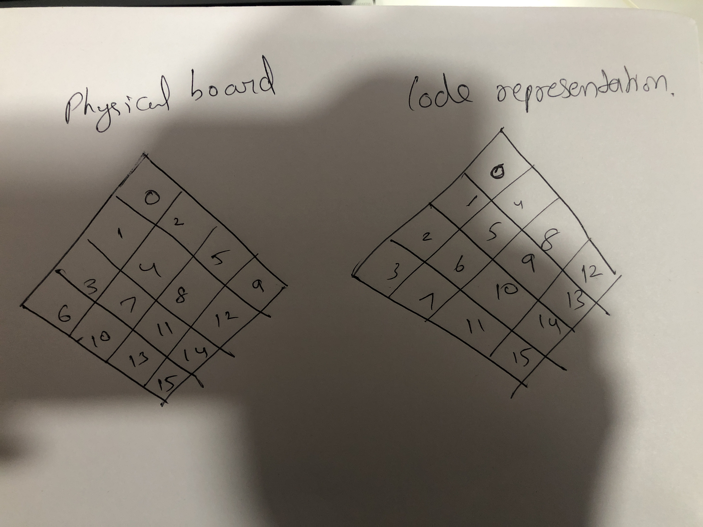

Motion is a interactive display system that can translate gestures that a user provides it , provides feedback through an array of mechanical flowers.
# Softwares that are required
A python ide <br>
An Arduino <br>
Iriun Webcam<br>
## Setting everything up
 all the code can be pulled from this github repo [https://github.com/alkrona/blooming_project.git](https://github.com/alkrona/blooming_project.git " bloom project repository")
<br>
1. Open the python code in an ide and create a virtual enviorment
<br>
**One of the libraries used mediapipe at the moment of making this doc is not compatiple with python3.9 or higher. So make sure your python version is lower than 3.9.**
<!--Code bloacks-->
```
python3 -m venv venv
source venv/bin/activate
```

2. All the required libraries are in the requirements.txt file

<!--Code bloacks-->
```
pip install -r requirements.txt
```
3. Install Iriun webcam on both your phone and your pc [link here]( https://iriun.com "link to download") . This enabes you to make your phone into a webcam. Make sure both devices operate on the same wifi network.
 * Now the program should be running properly. If something goes wrong check the following.
    *  if the error message is related to camera footage. Check if there are multiple or no cameras in your device.
    <!--Code bloacks-->
```python
import cv2 as cv
import mediapipe as mp
import posemodule as pm
import time 
import testing_wave_menu_integration
import testing_push_menu_integration
import testing_push_menu_intergration_version2
import arduino_sender
import circle_pattern
import circular_pattern
import random
import analytical_wave_speed_test
import pythonToFirebasesender
mode=1
cap = cv.VideoCapture(1)
cap.set(3,680)
cap.set(4,480)
```

* this is the file main2.py. here change the parameter of the VideoCapture function.
## Setting the wire connections

* blue wire is attached to SCL
* yellow to SDA
* red to ground 
* and finally blue to Vin
### at this point you should be able to see a red glow from the adafruit controller if the arduino or esp32 is connected to power.
<br>
<!--Portion for the setting up of arduino ide-->


<!--Getting the program to work-->
<!--Testing out the device-->
# Testing out the device
1. At this point the device should work. To start make sure the esp/arduino connections are proper. 
2. Turn on the SMPS and make sure that its connected to the Motion device.
3. Turn on the iriun app on both the phone and the pc. If working properly then the pc will receive footage from the phone.
4. Set up the phone on a tripod on a suitable location near the front of the the Motion device.
5. Run the python file menu2.py. Thats it the system should be active now.
6. The following video shows the gesture controls of the Motion device.
<!--Explaining the code -->
# Explanation of the code
The program start with the menu2.py file.
<br>
```python
    cap = cv.VideoCapture(1)
    cap.set(3,680)
    cap.set(4,480)
```
The videocapture function is used to set the correct webcam. 
The set module is use to control the size of the video display.(The video being streamed)

Next we create a object from the PoseDetector library. This is from Googles mediaPipe library which lets us use premade neural networks . This library is used to find the position points of different parts of the body using the video of the body.
```python
    detector=pm.PoseDetector(detectionCon=.8)
```
```python 
    while True:
    success,img = cap.read()
    img=cv.flip(img,1)
    img=detector.findPose(img)
    lmList,bbox=detector.findPosition(img,False)
```
Here we have a infinite loop , which on each iteration object the image form the webcam using the cap.read() function. 
Then the matrix of body position values are given to us with the findPostion function which supplies the data to the lmList variable.

### Output explanation for the Pose Function

<br>
The first column of the lmlist array corresponds to the 33 values of the points of the human body. The other 3 columns 1,2, and 3 provide the x,y,z cordinates of the points.

<br>
## Starting the program
The program check if the user shows a x gesture it detects it with the following code

``` python
    if lmList[16][1]>lmList[15][1] and lmList[14][2]>lmList[16][2] and lmList[14][2]>lmList[12][2] and lmList[13][2]>lmList[15][2] and lmList[13][2]>lmList[15][2] and time.time()>t_secondary+3:
```
If the program detects a X pose, then it closes the webcam and starts up the code for hand tracking with the following library.
<br>

```python
    testing_push_menu_intergration_version2.the_main_function()
``` 
<br>
The working of the hand tracking library will be explain in the hand tracking library section.
<br>
Exiting the handtracking module leads us into the wave finding module with the analytical_wave_speed_test library.
<br>

```python
    analytical_wave_speed_test.the_main_function()
```
 The explaination of how the wave function works will be explained in its subsection.
 After exiting the wave function , the program reverts back to the neutral state where it checks for a x pose to reinitiate the gesture generation.
<!-- Hand tracking program working-->
## How the hand tracking program works.
This code is written in the testing_push_menu_integration_version2.
The steps for initiating the camera and setting up the detector are similar to how the main2.py function works. 
<br>
The hand tracking module uses a class called Button, to represent and store the states of each of the 16 flowers present on the physical board.
<br>
One of the most important items to know is the mapping of flowers on the physical board and the mapping in the code.
The following image shows a visual representation.


<br>
This configuration is stored inside the dictionary Dict.
<br>
Lets skip to the meat and potatoes of the code.

```python
    if True and state1==0:
                for i,button in enumerate(buttonList):
                    button.Activation(x,y,img)
                    state=0
```

This loops through all the button elements and uses the activation module.

```python
    def Activation(self,x,y,img):
            if self.pos[0]>x-50 and self.pos[0]<x+50 and self.pos[1]>y and self.pos[1]<y+100:
                self.isactive=1
```

The activation module checks of the position of the finger of the right hand, is bound inside the digital representation of the button element. In case is it , it activates the is.active parameter of the button element.

Next 

<br>

```python
    for i,ele1 in enumerate(buttonList):
                        
            if ele1.is_active():
                            
                ele1.state_controller()
            Dict={0:6,1:10,2:13,3:15,4:3,5:7,6:11,7:14,8:1,9:4,10:8,11:12,12:0,13:2,14:5,15:9}
            matrix[Dict[i]]=ele1.current_value()

```
The code iterates though the button elements and changes its state.
The state represent the the angle to which the flower opens or closes. This is done with the state_controller meathod.

<br>
After setting the value, the arduino_sender meathod is utilised to serially sent the data to the arduino.
How it works is explained in the arduino sender section.
<!-- Wave creation function-->
<br>

# How the wave creation function works.

This function is quite similar to a window programs work.

```python
    def wave_direction_chooser(time_of_action,z_axis_values,array_var,lmList):
    if time.time()>time_of_action[array_var - 1] + 0.2:
                        choice=0
                        z_axis_values[array_var]=abs(lmList[15][1])
                        time_of_action[array_var]=time.time()
```

The program samples the value of the x and y coordinates of the right hand. at an interval of 0.2 seconds.
It continuously checks the maximum and mininum positions that the hand was in that interval.

<br>

whenever the distance between the max and min positions exceeds a particular limit, in this case 200 pixels.

<br>

```python

    z_min=min(mini)
    z_max=max(mini)
    if abs(z_max-z_min)>200:
```

It lets the function to produce a wave on the screen in that corresponding direction, with the main_wave_generator function.

<br>

following this it resets the window to accept new values.

<!--How the arduino sender function works-->

#Working of the arduino sender function

The arduino_sender module is used to sent the data from the image processing part onto the the arduino through serial communication.

It uses the mod_Library
The mod library essentially encodes the matrix into a string to sent it though serial.


